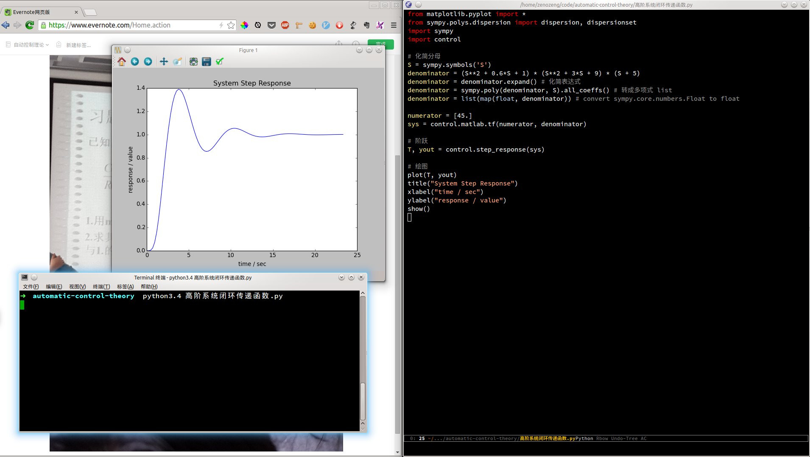

# automatic-control-theory

自动控制理论。Python 大法好！

## Requirement

- python3-numpy

- python3-scipy

```bash
sudo pip3 install matplotlib -i http://pypi.douban.com/simple/
sudo pip3 install control -i http://pypi.douban.com/simple/
sudo pip3 install sympy -i http://pypi.douban.com/simple/
```

## Usage

```bash
python3.4 高阶系统闭环传递函数.py
```



## Notes

```python
from sympy import sympify
s = sympify("(x**2 + 0.6*x + 1) * (x**2 + 3*x + 9) * (x + 5)")
```

以及注意 all_coeffes 输出的是 sympy.core.numbers.Float 类型。

## Links

- http://python-control.sourceforge.net/manual/

- http://matplotlib.org/users/pyplot_tutorial.html

- http://docs.sympy.org/latest/modules/core.html

- http://docs.sympy.org/latest/modules/polys/reference.html
